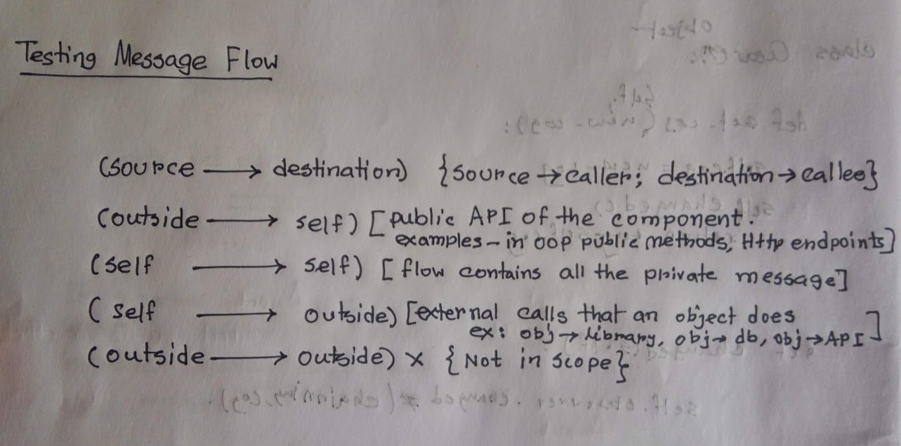
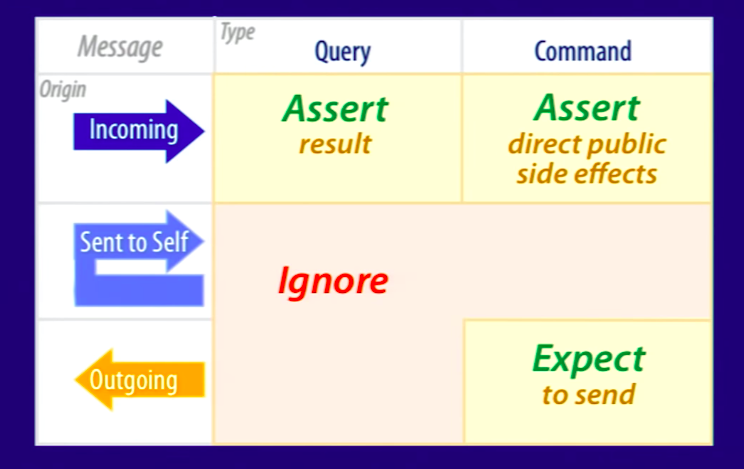

# Testing

Writing tests, rules, managing them with loads of examples

## Table of contents

- [Concepts](#concepts)
- [TDD Rules](#tdd-rules)
- [Magic Tricks of Testing](#magic-tricks-of-testing)
  - [Message Testing Rules](#message-testing-rules)
- [Mocking Objects](#mocking-objects)
  - [Simple Return Value](#simple-return-value)
  - [Complex Return Value](#complex-return-value)

### Concepts

#### Types of Test

- **Unit tests**: Make sure a class or a function works as expected in isolation
- **Functional tests**: Verify that the microservice does what it says from the consumer's point of view, and behaves correctly even on bad requests
- **Integration tests**: Verify how a microservice integrates with all its network dependencies
- **Load tests**: Measure the microservice performances
- **End-to-end tests**: Verify that the whole system works with an end-to-end test

### TDD Rules

- Write Tests First, Code Letter
- Add the reasonably amount of code you need to pass the tests
- You Shouldn't have more than one failing test
- Write code that passes the test and refactor it
- A test should fail the first time you run it. If it doesn’t, ask yourself why you are adding it.
- Never refactor w/o tests.

#### How many assertions

- If the test conditions are logical `AND` - then go for multiple assertions.
- if the conditions are logical - `OR` - Multiple Test functions.

#### How to Fix Bugs

From the TDD point of view, if you don’t have a failing test there is no bug, so you have to come up with at least one test that exposes the issue you are trying to solve.

### Magic Tricks of Testing

Testing should be based on the message flow between objects. For Example there are two types of messages -

1. **Query** - Return Something / Change Nothing
2. **Command** - Return Nothing / Change

And There are three ways message can flow between objects

1. **Incoming Messages** - messages a method receives
2. **Self to Self Messages** - calling to private method
3. **Outgoing Messages** - messages a method return to another method



#### Message Testing Rules

- **Incoming Query Message** - test incoming query messages by making assertions about what they send back. Also test the interface not the implementation.

  Now this following method should return the 2\*input. For example if you give 2 it should return 4. It's a query message because whatever you send it does not change the state, rather it does some computation and return the value.

  ```py
  class Hello:
      def world(self, x):
          return x*2
  ```

  To test it we should only need to assert the return value. We don't what it does inside from a TDD point of view.

  ```py
  def test_world():
      assert Hello().world(2) == 4
  ```

- **Incoming Command Message** - Assert about direct public side effects. For example - we might call a setter to set a value. By this way we are directly changing it's state. So we need to assert the changed state

  ```py
  class Hello:
      def set_world(self, x):
          self.world_name = x
  ```

  ```py
  def test_set_world():
      h = Hello()
      h.set_world('earth')
      assert h.world_name == 'earth'
  ```

- **Self-to-self Query/Command Message** - These are the conditions when a public method calls a private method. The Whole Application does not know about it. Only the public method are supposed to access it.

  If the tested public method can access it and got the expected value it should, then no need to test it.

- **Outgoing Query Message** - Say for example we are passing a value to another method. If it does not change the state we should not test it. Cause we are already testing `Incoming Query Message`.
- **Outgoing Command Message** - they directly change the state of others by calling setters. There is a clear distinction between `Incoming Command` and `Outgoing Command`. For Example if we are testing the `setter` method than we call it `Incoming Command`, otherwise `Outgoing Commnad`. Use a `Mock Object` to hide the implementation. Cause this is a `unit test` not the `integration test`.

  **Mock Objects and their originals** should play by **common API**.



### Mocking Objects

```py
>>> from unittest import mock
>>> m = mock.Mock()
>>> dir(m)
['assert_any_call', 'assert_called_once_with', 'assert_called_with', 'assert_has_cal\
ls', 'attach_mock', 'call_args', 'call_args_list', 'call_count', 'called', 'configur\
e_mock', 'method_calls', 'mock_add_spec', 'mock_calls', 'reset_mock', 'return_value'\
, 'side_effect']

>>> m.some_attribute
<Mock name='mock.some_attribute' id='140222043808432'>

>>> dir(m)
['assert_any_call', 'assert_called_once_with', 'assert_called_with', 'assert_has_cal\
ls', 'attach_mock', 'call_args', 'call_args_list', 'call_count', 'called', 'configur\
e_mock', 'method_calls', 'mock_add_spec', 'mock_calls', 'reset_mock', 'return_value'\
, 'side_effect', 'some_attribute']

```

As you can see this class is somehow different from what you are used to. First of all, its instances do not raise an AttributeError when asked for a non-existent attribute, but they happily return another instance of Mock itself. Second, the attribute you tried to access has now been created inside the object and accessing it returns the same mock object as before.

Mock objects are callables, which means that they may act both as attributes and as methods. If you try to call the mock it just returns another mock with a name that includes parentheses to signal its callable nature

```py
>>> m.some_attribute
<Mock name='mock.some_attribute' id='140222043808432'>

>>> m.some_attribute()
<Mock name='mock.some_attribute()' id='140247621475856'>
```

#### Simple Return Value

```py
>>> m.some_attribute.return_value = 42
>>> m.some_attribute()
42
```

the mock returns is exactly the object that it is instructed to use as return value. If the return value is a callable such as a function, calling the mock will return the function itself and not the result of the function. Let me give you an example

```py
>>> def print_answer():
... print("42")
...
>>>
>>> m.some_attribute.return_value = print_answer
>>> m.some_attribute()
<function print_answer at 0x7f8df1e3f400>
```

#### Complex Return Value

The side_effect parameter of mock objects is a very powerful tool. It accepts three different flavours of objects: callables, iterables, and exceptions, and changes its behaviour accordingly.

- **If you pass an exception** the mock will raise it

  ```py
  >>> m.some_attribute.side_effect = ValueError('A custom value error')
  >>> m.some_attribute()
  Traceback (most recent call last):
  File "<stdin>", line 1, in <module>
  File "/usr/lib/python3.6/unittest/mock.py", line 939, in __call__
  return _mock_self._mock_call(*args, **kwargs)
  File "/usr/lib/python3.6/unittest/mock.py", line 995, in _mock_call
  raise effect
  ValueError: A custom value error
  ```

- **If you pass an iterable**, such as for example a generator, a plain list, tuple, or similar objects, the mock will yield the values of that iterable, i.e. return every value contained in the iterable on subsequent calls of the mock.

  ```py
  >>> m.some_attribute.side_effect = range(3)
  >>> m.some_attribute()
  0
  >>> m.some_attribute()
  1
  >>> m.some_attribute()
  2
  >>> m.some_attribute()
  Traceback (most recent call last):
  File "<stdin>", line 1, in <module>
  File "/usr/lib/python3.6/unittest/mock.py", line 939, in __call__
  return _mock_self._mock_call(*args, **kwargs)
  File "/usr/lib/python3.6/unittest/mock.py", line 998, in _mock_call
  result = next(effect)
  StopIteration
  ```

  As this raises `StopIteration` you can safely use this mock object in a loop.

- **if you feed side_effect a callable**, the latter will be executed with the parameters passed when calling the attribute.

  ```py
  >>> def print_answer():
  ...
  print("42")
  >>> m.some_attribute.side_effect = print_answer
  >>> m.some_attribute()
  42
  ```

  Slightly, More complex example with arguments

  ```py
  >>> def print_number(num):
  ...
  print("Number:", num)
  ...
  >>> m.some_attribute.side_effect = print_number
  >>> m.some_attribute(5)
  Number: 5
  ```

**Side Effect can be given a class** and return an instance of it.

```py
>>> class Number:
    ...  def __init__(self, value):
    ...     self._value = value
    ...  def print_value(self):
    ...     print("Value:", self._value)
    ...

>>> m.some_attribute.side_effect = Number

>>> n = m.some_attribute(26)

>>> n
<__main__.Number object at 0x7f8df1aa4470>

>>> n.print_value()
Value: 26
```

#### Asserting Calls

```py
from unittest import mock
import my_obj_to_be_tested


def test_connect():
    external_obj = mock.Mock()
    my_obj_to_be_tested.MyObj(external_obj)
    external_obj.connect.assert_called_with()
```

Here we are testing `connect` method of `MyObj`. We are passing an `external_obj` to `MyObj` constructor. this `external_obj` can be anything like -

- database_object
- third-party-library
- saas API or anything

The Point is we don't know what `external_obj` does behind the scenes. All we know our `MyObj` should call `external_obj`'s `connect` method. That's it. The rest is upto the service to do whatever it response, that's not headache for this scenario. Surely, that `external_obj` will make sure it sends response based on the documentation they provide. But it is their responsibility to test them, not `MyObj`'s.

We expect `MyObj` to call the `external_obj`'s `connect` method. So we express the expectation calling `external_obj.connect.assert_called_with()`.

What happens behind the scenes? The MyObj class receives the fake external object and somewhere in its initialization process calls the connect method of the mock object. This call creates the method itself as a mock object. This new mock records the parameters used to call it and the subsequent call to its assert_called_with method checks that the method was called and that no parameters were passed.

In this case an object like -

```py
class MyObj():
    def __init__(self, repo):
        repo.connect()
```

would pass the test, as the object passed as `repo` is a mock that **does nothing but record the calls**. As you can see, the `__init__()` method actually calls `repo.connect()` , and `repo` is expected to be a full-featured external object that provides connect in its API. Calling `repo.connect()` when `repo` is a **mock object**, instead, silently creates the method (as another mock object) and **records that the method has been called once without arguments**.

The `assert_called_with` method allows us to also **check the parameters we passed when calling**.

To show this let us pretend that we expect the `MyObj.setup` method to call `setup(cache=True, max_connections=256)` on the external object. Remember that this is an outgoing command, so **we are interested in checking the parameters and not the result**.

The new test can be something like -

```py
def test_setup():
    external_obj = mock.Mock()
    obj = myobj.MyObj(external_obj)
    obj.setup()
    external_obj.setup.assert_called_with(cache=True, max_connections=256)
```

In this case an object that passes the test can be -

```py
class MyObj():
    def **init**(self, repo):
        self._repo = repo
        repo.connect()

    def setup(self):
        self._repo.setup(cache=True, max_connections=256)
```

If we change the setup method to -

```py
def setup(self):
    self._repo.setup(cache=True)
```

the test will fail with the following error

```shell
E AssertionError: Expected call: setup(cache=True, max_connections=256)
E Actual call: setup(cache=True)
```

## Built With

- [pytest](https://docs.pytest.org/en/latest/) - The testing framework used for python

## Contributing

Please read [CONTRIBUTING.md](./.github/CONTRIBUTING.md) for details on our code of conduct, and the process for submitting pull requests to us.

## Versioning

We use [SemVer](http://semver.org/) for versioning. For the versions available, see the [tags on this repository](https://github.com/your/project/tags).

## Authors

- **Alamin Mahamud** - _Initial work_ - [alamin-mahamud](https://github.com/alamin-mahamud)

See also the list of [contributors](https://github.com/your/project/contributors) who participated in this project.

## License

This project is licensed under the MIT License - see the [LICENSE.md](LICENSE.md) file for details

## Acknowledgments

- Hat tip to anyone whose code was used
- Inspiration
- etc

## Resources

- [The magic tricks of testing](https://speakerdeck.com/skmetz/magic-tricks-of-testing-railsconf)
- [Clean Architecture Python](http://www.thedigitalcatonline.com/blog/2016/11/14/clean-architectures-in-python-a-step-by-step-example/)
