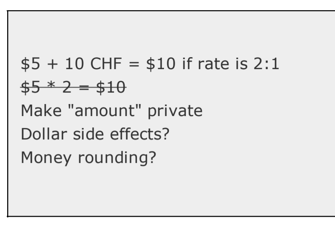

# Test Driven Development - Kent Beck

## Table of Contents

- Money Example


## Money Example

### Objectives

- Multi Currency Support for existing Dollar based Payment System

### Workflow

- Quickly add a test
- Run all tests  and see the new one  fail
- Make a Little change
- Run all tests and see them all succeed
- Refactor to remove duplication
 
 
Running the tests we are making sure what is obvious to us is also obvious to our system. 
 
As soon as we get an error

- we back up, 
- shift to fake implementations 
- and refactor to right code


The translation of feeling into test. The longer we do it the better we able to translate our aesthetic judgement into tests

As soon we are refactoring we need to make sure we are using new functionality to avoid coupling between tests. <-- Thoughts?

We will often work on system there is no TDD for part of the code we are working upon. One way to tackle this is 
- Write the test that you wish you had. If you don't you will eventually break something while refactoring.
- retroactively test before refactoring

---


- compare franc with dollar

```python

def test_equals():
    assert Franc(5) == Franc(5)
    assert Dollar(5) == Dollar(5)

    assert not Franc(6) == Franc(69)
    assert not Dollar(50) == Dollar(55)

    assert Franc(5) == Dollar(5)

```

- it's passing (we know our logic is flawed)


### Problem

- Report Format


- to make a multi currency report we need to add currencies

- also specify exchange rates


```
$5 + 10CHF = $10 if rate is 2:1
$5 * 2 = $10
```

```python
# $5 * 2 = $10
def test_multiply_dollars():
    dollar = Dollar(5)
    dollar.times(2)
    assert dollar.amount == 10
```

^ Problems?

- no Dollar Class
- no times method
- no amount attribute
- integer for Currency

```
Traceback (most recent call last):
  File "test.py", line 6, in <module>
    test_multiply_dollars()
  File "test.py", line 2, in test_multiply_dollars
    dollar = Dollar(5)
NameError: global name 'Dollar' is not defined
```

Let's solve one by one

- first lets create a Dollar Class

```python
class Dollar:
    pass
```

- then another error pops up

```
Traceback (most recent call last):
  File "test.py", line 9, in <module>
    test_multiply_dollars()
  File "test.py", line 5, in test_multiply_dollars
    dollar = Dollar(5)
TypeError: this constructor takes no arguments
```

- lets create constructor with arguments

```python
class Dollar:
    def __init__(self, amount):
        pass
```

- next error about times method

```
Traceback (most recent call last):
  File "test.py", line 9, in <module>
    test_multiply_dollars()
  File "test.py", line 6, in test_multiply_dollars
    dollar.times(2)
AttributeError: Dollar instance has no attribute 'times'

```

- added `times` method

```python
class Dollar:
    def __init__(self, amount):
        pass

    def times(self, multiplier):
        pass
```

- next error - no amount field

```
Traceback (most recent call last):
  File "test.py", line 9, in <module>
    test_multiply_dollars()
  File "test.py", line 7, in test_multiply_dollars
    assert dollar.amount == 10
AttributeError: Dollar instance has no attribute 'amount'
```

- adding amount field

```python
class Dollar:
    def __init__(self, amount):
        self.amount = None

    def times(self, multiplier):
        pass
```

- then we are getting assertion error
```
Traceback (most recent call last):
  File "test.py", line 9, in <module>
    test_multiply_dollars()
  File "test.py", line 7, in test_multiply_dollars
    assert dollar.amount == 10
AssertionError
```
- fixing the logic just enough to pass the test

```python
class Dollar:
    def __init__(self, amount):
        self.amount = None

    def times(self, multiplier):
        self.amount = 5 * 2
```

- and in the end it passed

- now eliminating duplication

> Depenedecy is a key problem, the symptom is duplication

^ Objects are excellent for abstracting away the duplication of logic.

By eliminating dupliation before we go on to the next test, we maximize our chance of being able to get the next test running with one and only one change

```python
class Dollar:
    def __init__(self, amount):
        self.amount = amount

    def times(self, multiplier):
        self.amount = self.amount * multiplier
```



Our current workflow

- made a todo list
- snippet explaining our course of action input/output
- made the test compile with stubs
- made the test run by dummy code (horrible sins)
- gradually generalizing the working code replacing consts with vars
- rather than addressing all, tackling them one by one

---

*TDD Cycle*

- Clearly Delineate the interface in paper
- Make it run with dummy code. Red --> Green Feedback Loop
  - if the solution is obvious do it once
  - otherwise take small step and go to that phase incrementally
- Now Refactor the code and remove the duplicated stuff away

Divide and Conquer. 
First make it work, then refactor to achieve clean code


Let's focus on Dollar Side Effects - we want to call the method multiple times without changing the initial `amount` field

```python
from dollar import Dollar


def test_multiply_dollars():
    dollar = Dollar(5)
    dollar.times(2)
    assert dollar.amount == 10
    dollar.times(3)
    assert dollar.amount == 15


test_multiply_dollars()

```

- test fails
```python
Traceback (most recent call last):
  File "test.py", line 12, in <module>
    test_multiply_dollars()
  File "test.py", line 9, in test_multiply_dollars
    assert dollar.amount == 15
AssertionError
```

- now changing the test to have another object for the product

```python
from dollar import Dollar


def test_multiply_dollars():
    dollar = Dollar(5)
    product = dollar.times(2)
    assert product.amount == 10
    product = dollar.times(3)
    assert product.amount == 15


test_multiply_dollars()

```

- test fails

```python
Traceback (most recent call last):
  File "test.py", line 12, in <module>
    test_multiply_dollars()
  File "test.py", line 7, in test_multiply_dollars
    assert product.amount == 10
AttributeError: 'NoneType' object has no attribute 'amount'
```
- returning product from `Dollar`

```python
class Dollar:
    def __init__(self, amount):
        self.amount = amount

    def times(self, multiplier):
        return Dollar(self.amount * multiplier)

```

- test passes


---


```python
def test_equality():
    dollar1 = Dollar(5)
    dollar2 = Dollar(5)
    assert dollar1 == dollar2
```

- assertion error
```python
Traceback (most recent call last):
  File "test.py", line 19, in <module>
    test_equality()
  File "test.py", line 15, in test_equality
    assert dollar1 == dollar2
AssertionError
```

- adding `__eq__` 

```python
class Dollar:
    def __init__(self, amount):
        self.amount = amount

    def times(self, multiplier):
        return Dollar(self.amount * multiplier)

    def __eq__(self, other):
        return true
```

- test passes

- adding another condition fails

```python
def test_equality():
    dollar1 = Dollar(5)
    dollar2 = Dollar(5)
    assert dollar1 == dollar2

    dollar1 = Dollar(10)
    dollar2 = Dollar(11)
    assert not dollar1 == dollar2

```

- update the logic

```python
class Dollar:
    def __init__(self, amount):
        self.amount = amount

    def times(self, multiplier):
        return Dollar(self.amount * multiplier)

    def __eq__(self, other):
        return self.amount == other.amount

```

- test passed
- some more test cases


---


- removed the `amount` attr usage from outside `Dollar`

```python
def test_multiply_dollars():
    dollar = Dollar(5)
    assert dollar.times(2) == Dollar(10)
    assert dollar.times(3) == Dollar(15)
```

- and added a property for `amount`
```python
class Dollar:
    def __init__(self, amount):
        self._amount = amount

    @property
    def amount(self):
        """Gets amount"""
        return self._amount

    def times(self, multiplier):
        return Dollar(self.amount * multiplier)

    def __eq__(self, other):
        return self.amount == other.amount

``` 

- test passes

now our todo list looks like 


---


- test for Franc Multiplication

```python
def test_franc_multiplication():
    franc = Franc(5)
    assert franc.times(2) == Franc(10)
    assert franc.times(3) == Franc(15)

```

- doing all the usual step by step progress to get an working state

```python
class Franc:
    def __init__(self, amount):
        pass

    def times(self, multiplier):
        pass

    def __eq__(self, other):
        return True
```

- since the above stuff passes let's move onto another test

```python

def test_franc_equals():
    franc1 = Franc(5)
    franc2 = Franc(5)
    assert franc1 == franc2

    franc1 = Franc(6)
    franc2 = Franc(65)
    assert not franc1 == franc2
```

- to make the ^ test work, made the following change

```python
class Franc:
    def __init__(self, amount):
        self._amount = amount

    @property
    def amount(self):
        return self._amount

    def times(self, multiplier):
        return Franc(self.amount * multiplier)

    def __eq__(self, other):
        return self.amount == other.amount

```

- now we have another problem. *Duplication*. 
  - Two equals for two currency
  - Two times for two currency
Assume this for multiple currencies, our code will grow, so as our duplicacies

---


Avoiding Duplication 

- creating SuperClass `Money`
 
---


- comparing Franc with Dollars

```python

def test_equals():
    assert Franc(5) == Franc(5)
    assert Dollar(5) == Dollar(5)

    assert not Franc(6) == Franc(69)
    assert not Dollar(50) == Dollar(55)

    assert Franc(5) == Dollar(5)

```

- here is the change of snippet to do the comparison

```python
def __eq__(self, other):
    print(f"__eq__ called --> self:{self!r} \n other:{other!r}")
    return (self.amount == other.amount) and \
           (self.__class__.__name__ == other.__class__.__name__)

```

---


- removing duplication of times

```python
class Money:
    def __init__(self, amount):
        self._amount = amount

    @property
    def amount(self):
        return self._amount

    def __eq__(self, other):
        return (self.amount == other.amount) and \
               (self.__class__.__name__ == other.__class__.__name__)

    @classmethod
    def get_instance_of_called_class(cls, amount):
        return cls(amount)

    def times(self, multiplier):
        return self.get_instance_of_called_class(self.amount * multiplier)

```

---


- adding currency support
- tests are updated

```python
from dollar import Dollar
from franc import Franc


def test_multiplication():

    # test_franc_multiplication
    franc = Franc(5, "CHF")
    assert franc.times(2) == Franc(10, "CHF")
    assert franc.times(3) == Franc(15, "CHF")

    # test_dollar_multiplication
    dollar = Dollar(5, "USD")
    assert dollar.times(2) == Dollar(10, "USD")
    assert dollar.times(3) == Dollar(15, "USD")


def test_equals():
    assert Franc(5, "CHF") == Franc(5, "CHF")
    assert Dollar(5, "USD") == Dollar(5, "USD")
    assert not Franc(6, "CHF") == Franc(69, "CHF")
    assert not Dollar(50, "USD") == Dollar(55, "USD")
    assert not Franc(5, "CHF") == Dollar(5, "USD")


def test_currency():
    assert "USD" == Dollar(1, "USD").currency
    assert "CHF" == Franc(1, "CHF").currency


test_equals()
test_multiplication()

test_currency()

```

- *Money* class

```python
class Money():
    def __init__(self, amount, currency):
        self._amount = amount
        self._currency = currency

    @property
    def amount(self):
        return self._amount

    @property
    def currency(self):
        return self._currency

    def __eq__(self, other):
        return (self.amount == other.amount) and \
               (self.currency == other.currency)

    @classmethod
    def get_instance_of_called_class(cls, amount, currency):
        return cls(amount, currency)

    def times(self, multiplier):
        return self.get_instance_of_called_class(self.amount * multiplier, self.currency)

```

- *Frank* Class

```python
class Franc(Money):
    pass

```

- *Dollar* Class

```python
class Dollar(Money):
    pass
```

- now do we even need these ^ classes?

---


- now let's remove the subclasses
- removed `Franc`
- removed `Dollar`
- removed duplicate tests

```python

def test_multiplication():
    money = Money(5, "CHF")
    assert money.times(2) == Money(10, "CHF")
    assert money.times(3) == Money(15, "CHF")


def test_equals():
    assert Money(5, "CHF") == Money(5, "CHF")
    assert not Money(6, "CHF") == Money(69, "CHF")
    assert not Money(5, "CHF") == Money(5, "USD")


def test_currency():
    assert "USD" == Money(1, "USD").currency
    assert "CHF" == Money(1, "CHF").currency


def test_to_string():
    assert str(Money(1, 'USD')) == '1 USD'

```
---

### Possibilities

*Method*: Team needs to have a consistent experience growing the design of the system, little by little so the mechanics of the transformation are well practiced

*Motive* - business importance of  the feature and have the courage to do seemingly impossible task

*Opportunity* - combination of comprehensive, confidence-generated tests, well-factored program makes possible to isolate design decision which helps the team to identify the few potential sources of errors 
 
### Thoughts

- How each test  cover a small increment of functionality
- How small and ugly the changes can be to make the new tests run
- How often the tests are run
- How many teensy-weensy steps make up the refactorings
- Every time I am making changes to the codebase stale codes & tests needs to be removed. (that looks cumbersome!)